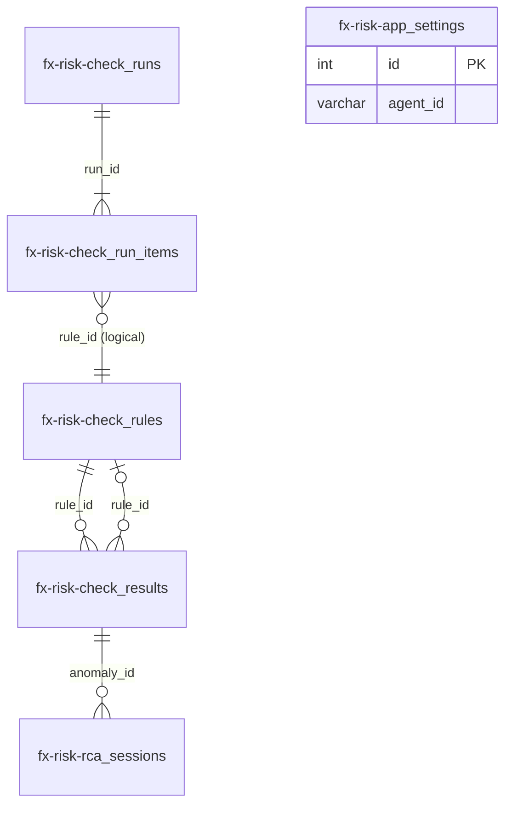

# FX-RISK-AI 数据库表结构

**扩展标识：** `fx-risk-ai`  
**PostgreSQL Schema：** `fx_risk_ai`  
**实体源码：** `extensions/fx-risk-ai/src/api/db/entities/`  
**增量迁移：** `extensions/fx-risk-ai/src/api/db/migrations/`  
**最后同步：2026-05-25（V1.0.0 规划初稿）

---

## 维护说明

| 何时更新本文档 | 操作 |
|----------------|------|
| 新增/修改 `@ExtensionEntity` 字段 | 更新对应表章节；在「迁移记录」追加条目 |
| 新增迁移文件 | 在「迁移记录」登记 `up` 行为 |
| 枚举/状态值变更 | 更新各表「取值」与「写入时机」 |
| PRD §四 数据模型变更 | 同步 `docs/PRD-FX-RISK-AI.md` 与本文件 |

**权威来源：** 以 TypeORM 实体为准；本文档为可读说明。安装/启用扩展时由平台 **TypeORM synchronize** 按实体建表；`migrations/*.ts` 仅做已有库的增量 `ALTER`。

---

## 概览

### Schema 隔离

- 所有 FXR 业务表位于 **`fx_risk_ai`**，与平台 `public` 库表分离。
- Schema 名由扩展目录名经 `getExtensionSchemaName("fx-risk-ai")` 得到（见 `@buildingai/core`）。

### 表命名

- 本应用独立使用的表名统一前缀 **`fx-risk-`**（与扩展标识一致），位于 schema **`fx_risk_ai`**。
- SQL / MCP 中须双引号引用，例如：`SELECT * FROM "fx_risk_ai"."fx-risk-check_rules"`。
- 常量定义：`extensions/fx-risk-ai/src/api/db/fx-risk-table-names.ts`。

### 表清单

| 表名 | 实体类 | 用途 |
|------|--------|------|
| `fx-risk-check_rules` | `CheckRule` | 数据健康检查规则（配置） |
| `fx-risk-check_results` | `CheckResult` | 单次检查发现的问题 / 异常明细 |
| `fx-risk-check_runs` | `CheckRun` | 一次「全量检查」批次 |
| `fx-risk-check_run_items` | `CheckRunItem` | 批次内每条规则的执行状态 |
| `fx-risk-app_settings` | `AppSettings` | 应用级配置（平台智能体 ID） |
| `fx-risk-rca_sessions` | `RcaSession` | 根因分析会话占位（V1.1 轻量） |

### 关系示意

- `fx-risk-check_results.rule_id` → `fx-risk-check_rules.rule_id`：**逻辑关联**（未建 DB 外键）。
- `fx-risk-check_run_items.rule_id` 对应当次批次中启用的规则。
- `fx-risk-app_settings` 设计为**单行**（种子/设置服务按 id 读写）。

---

## `fx-risk-check_rules` — 检查规则

**用途：** 驾驶舱健康分、全量检查编排、规则管理 CRUD 的数据源。仅 `enabled = true` 的规则参与 `POST /check-runs` 与智能体 `bowi_start_full_check`（`appId: fx-risk-ai`）。

| 列名 | TypeORM 类型 | 可空 | 默认 | 说明 |
|------|--------------|------|------|------|
| `id` | `serial` PK | 否 | 自增 | 内部主键 |
| `rule_id` | `varchar(20)` UNIQUE | 否 | — | 业务 ID，如 `FX_001` |
| `business_domain` | `varchar(20)` | 否 | — | 业务域：敞口 / 汇兑损益 / 汇率 / 对冲 等 |
| `data_item` | `varchar(100)` | 否 | — | 被检查的数据项目名 |
| `rule_description` | `text` | 否 | — | 自然语言规则描述（交给 Agent） |
| `deduct_score` | `int` | 否 | — | 健康分扣分权重 1–100 |
| `severity` | `varchar(10)` | 否 | — | 规则严重度：`高` / `中` / `低` |
| `auto_fix` | `boolean` | 否 | `false` | 是否允许 AI 自动修复 |
| `enabled` | `boolean` | 否 | `true` | 是否参与检查 |
| `create_time` | `timestamp` | 否 | 自动 | 创建时间 |
| `update_time` | `timestamp` | 否 | 自动 | 更新时间 |

**主要读写：**

- 读：`RulesService`、`DashboardService`（聚合）、bowi-mcp `bowi_start_full_check`（`appId: fx-risk-ai`）
- 写：规则 Console API、`FXRAiDataSeeder`（空库演示数据）

**索引建议：** `rule_id` 唯一；列表可按 `(enabled, business_domain)` 过滤。

---

## `fx-risk-check_results` — 检查结果 / 异常

**用途：** 异常明细列表、驾驶舱统计、根因分析入口。由 Agent 检查 JSON 经 `ingest` 或 MCP `fx_risk_ingest_rule_result` 写入；同 `anomaly_id` 已存在则跳过（不覆盖）。

| 列名 | TypeORM 类型 | 可空 | 默认 | 说明 |
|------|--------------|------|------|------|
| `id` | `serial` PK | 否 | 自增 | 内部主键 |
| `anomaly_id` | `varchar(50)` UNIQUE | 否 | — | 业务 ID，如 `ANOM-20260524-001` |
| `rule_id` | `varchar(20)` | 否 | — | 关联 `fx-risk-check_rules.rule_id` |
| `description` | `text` | 否 | — | 异常描述 |
| `risk_level` | `varchar(10)` | 否 | — | 风险：`高` / `中` / `低`（列表筛选用） |
| `root_cause` | `text` | 是 | — | 根因分析文案 |
| `solution` | `text` | 是 | — | 建议解决方案 |
| `status` | `varchar(20)` | 否 | — | `待解决` / `已解决` / `ai自动修复` |
| `auto_fixed` | `boolean` | 否 | `false` | 是否已由 AI 自动修复 |
| `check_time` | `timestamp` | 否 | — | **检查时间**（ingest 批次写入时刻） |
| `resolved_at` | `timestamp` | 是 | — | **解决时间**；见下方写入规则 |
| `create_time` | `timestamp` | 否 | 自动 | **记录创建时间** |

**`status` / `resolved_at` 写入规则**（`anomaly-status.ts`）：

- 新建且 `status` 为 `已解决` 或 `ai自动修复` → `resolved_at = now`
- `PATCH` 改状态为已解决类 → 首次解决写入 `now`；若已是已解决类且已有 `resolved_at` → **保留原值**
- 改回 `待解决` → `resolved_at = null`

**主要读写：**

- 读：`AnomaliesService`、`DashboardService`
- 写：`CheckRunsService.ingest`、`AnomaliesService.updateStatus`、种子数据

**索引建议：** `anomaly_id` 唯一；`rule_id`、`status`、`check_time` 供列表与聚合。

---

## `fx-risk-check_runs` — 检查批次

**用途：** 一次「全量检查」的生命周期；同时仅允许一条 `status = running`（`CheckRunsService.start` 校验）。

| 列名 | TypeORM 类型 | 可空 | 默认 | 说明 |
|------|--------------|------|------|------|
| `id` | `serial` PK | 否 | 自增 | 批次 ID（工具/API 中的 `runId`） |
| `status` | `varchar(20)` | 否 | `running` | `running` / `completed` / `cancelled` |
| `create_time` | `timestamp` | 否 | 自动 | 批次开始时间 |
| `update_time` | `timestamp` | 否 | 自动 | 最后更新时间 |
| `finished_at` | `timestamp` | 是 | — | 完成或取消时刻 |

**状态流转：**

- `running` → 全部 `fx-risk-check_run_items` 为 `done` 或 `failed` → `completed` + `finished_at`
- `running` → 用户/工具取消 → `cancelled` + `finished_at`

**主要读写：** `CheckRunsService`、bowi-mcp `bowi_start_full_check` / `bowi_get_check_progress` / `bowi_cancel_check`（`appId: fx-risk-ai`）

---

## `fx-risk-check_run_items` — 批次内规则项

**用途：** 跟踪全量检查中每条规则的执行进度；可记录该规则对应平台对话 ID。

| 列名 | TypeORM 类型 | 可空 | 默认 | 说明 |
|------|--------------|------|------|------|
| `id` | `serial` PK | 否 | 自增 | 内部主键 |
| `run_id` | `int` | 否 | — | FK 逻辑关联 `fx-risk-check_runs.id` |
| `rule_id` | `varchar(20)` | 否 | — | 本批次检查的规则 |
| `status` | `varchar(20)` | 否 | `pending` | `pending` / `done` / `failed` |
| `conversation_id` | `varchar(64)` | 是 | — | 平台智能体对话 ID（ingest 时可回填） |
| `error_message` | `text` | 是 | — | JSON 解析失败等错误信息 |
| `create_time` | `timestamp` | 否 | 自动 | 创建时间 |
| `update_time` | `timestamp` | 否 | 自动 | 更新时间 |

**`status` 含义：**

| 值 | 说明 |
|----|------|
| `pending` | 等待 Agent 检查并 ingest |
| `done` | ingest 成功（含 0 条异常） |
| `failed` | 响应 JSON 解析/校验失败 |

**主要读写：** `CheckRunsService`（start / ingest / progress）

---

## `fx-risk-app_settings` — 应用设置

**用途：** 绑定 外汇风险自治 使用的**平台智能体**（`public` 库 `ai_agents` 等，非本 schema 表）。

| 列名 | TypeORM 类型 | 可空 | 默认 | 说明 |
|------|--------------|------|------|------|
| `id` | `serial` PK | 否 | 自增 | 通常仅 id=1 一行 |
| `agent_id` | `varchar(64)` | 是 | — | 平台智能体 UUID |
| `update_time` | `timestamp` | 否 | 自动 | 最后保存时间 |

**历史字段（已删除，见迁移 `0.1.1`）：** `model_id`、`mcp_server_ids` — 模型与 MCP 改由智能体配置承载。

**主要读写：** `SettingsService`、`FXRPlatformAgentSeeder`、设置页「更新 外汇风险自治助手」

---

## `fx-risk-rca_sessions` — 根因分析会话

**用途：** V1.1 为根因分析模态框预留会话记录；创建时校验 `anomaly_id` 存在于 `fx-risk-check_results`。

| 列名 | TypeORM 类型 | 可空 | 默认 | 说明 |
|------|--------------|------|------|------|
| `id` | `serial` PK | 否 | 自增 | 会话 ID |
| `anomaly_id` | `varchar(50)` | 否 | — | 关联异常 |
| `conversation_id` | `varchar(64)` | 是 | — | 平台对话 ID（后续可回填） |
| `create_time` | `timestamp` | 否 | 自动 | 创建时间 |

**主要读写：** `RcaService.createSession`

---

## 迁移记录

| 文件 | 说明 |
|------|------|
| `0.1.0-baseline.ts` | 规划基线：6 张核心表（synchronize 建表） |

> 基线表结构由扩展启用时的 **entity synchronize** 创建；上表为已有环境的增量变更。

---

## 种子数据

| Seeder | 条件 | 内容 |
|--------|------|------|
| `FXRPlatformAgentSeeder` | 无 `agent_id` 等 | 创建/关联平台智能体「外汇风险自治助手」 |
| `FXRCheckRulesCatalogSeeder` | 目录未齐或内容过期 | **30** 条检查规则（`FX_001`–`RULE_035`），默认 `enabled=false`；源码 `seed-data/fx-risk-check-rules-catalog.ts` |
| `FXRAiDataSeeder` | `fx-risk-check_results` 为空 | 2 条示例异常（可选演示） |

已有环境同步规则：`pnpm --filter fx-risk-ai seed:rules`（需先 `build:api`）。

源码：`extensions/fx-risk-ai/src/api/db/seeds/seeders/`

---

## 与平台库的关系

本 schema **不包含** LLM、MCP、对话消息等表。FXR 通过 `fx-risk-app_settings.agent_id` 引用平台 `ai_agents`；检查过程对话与 MCP 调用发生在平台侧。**bowi-mcp** 工具元数据同步至平台 `ai_mcp_tool` 等表（见 PRD §5.0 / 设置页「更新智能体」；HTTP 由 `fx-risk-ai` 托管，各应用共用）。

---

## 相关文档

| 文档 | 路径 |
|------|------|
| 产品需求（业务语义） | `docs/PRD-FX-RISK-AI.md` §四 |
| OpenSpec 数据模型 | `openspec/specs/fx-risk-ai-data-model/spec.md` |
| 扩展 README | `extensions/fx-risk-ai/README.md` |
