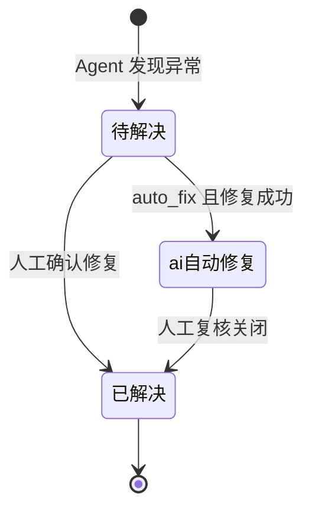

# 售后服务 SLA 自治系统（AI Agent 版）产品需求文档

**版本 V1.0.0（规划初稿）** · 产品需求 · 规划对齐 `extensions/service-sla-ai` 模板

---

## 一分钟速览

| 项目 | 说明 |
|------|------|
| **是什么** | BuildingAI 扩展 **service-sla-ai**：平台 **智能体 + MCP** 对 ERP 数据做规则检查、异常诊断与（可选）自动修复 |
| **四个页面** | 驾驶舱 · 监控规则 · 异常明细 · **设置**（绑定 售后服务 SLA 自治助手） |
| **主流程** | 配规则 → 智能体「开始巡检」→ **智能体工具**读规则表 + MCP 逐条检查 → JSON 落库 → 驾驶舱刷新 → 根因分析 |
| **入口** | 应用中心 `/apps/service-sla-ai`（iframe 加载 `/extension/service-sla-ai`）；扩展直连 `/extension/service-sla-ai` |
| **V1.1 亮点** | 异常 **根因分析** 模态框；顶栏 🤖 打开 **右侧可调宽 iframe 智能体栏**（平台 WebAPP 发布页） |
| **全量巡检** | 用户发送「开始巡检」→ 智能体通过统一 **bowi-mcp**（`appId: service-sla-ai`）编排 + **ERP MCP** 取数 |

**健康分公式（驾驶舱核心指标）：**

```
健康分 = 100 − (SLA违约×12 + 重复维修×8 + 备件缺货×6 + 低风险×2)
```

---

## 文档信息

| 项目 | 内容 |
|------|------|
| 文档名称 | 售后服务 SLA 自治系统（SERVICE-SLA-AI Agent）V1.0 产品需求文档 |
| 产品名称 | 售后服务 SLA 自治系统 |
| 版本号 | V1.0.0（规划初稿） |
| 编制人 | 产品经理 |
| 编制日期 | 2026-05-25 |
| 适用范围 | 基于 BuildingAI 平台，通过 AI Agent + MCP 实现售后服务 SLA 自治系统；规划对齐 `extensions/service-sla-ai` 模板 |

### 修订记录

| 版本 | 日期 | 说明 |
|------|------|------|
| V1.0.0 | 2026-05-25 | 售后服务 SLA 自治系统规划初稿（母版：ehcs-ai 扩展） |

### 阅读指南

| 你是… | 建议阅读 |
|--------|----------|
| 产品 / 业务 | [§一 概述](#一产品概述) → [§三 页面](#三功能模块与页面设计) → [§十 版本](#十版本规划) |
| 前端 | [§三 页面](#三功能模块与页面设计) → [§五 接口](#五ai-agent-接口定义) → [§八 验收](#八验收标准) |
| 后端 | [§四 数据模型](#四数据模型设计) → [§五 接口](#五ai-agent-接口定义) → [§六 非功能](#六非功能需求) |

---

## 目录

| # | 章节 |
|---|------|
| 一 | [产品概述](#一产品概述) |
| 二 | [系统架构与运行流程](#二系统架构与运行流程) |
| 三 | [功能模块与页面设计](#三功能模块与页面设计) |
| 四 | [数据模型设计](#四数据模型设计) |
| 五 | [AI Agent 接口定义](#五ai-agent-接口定义) |
| 六 | [非功能需求](#六非功能需求) |
| 七 | [权限与角色](#七权限与角色) |
| 八 | [验收标准](#八验收标准) |
| 九 | [附录：演示数据样例](#九附录演示数据样例) |
| 十 | [版本规划](#十版本规划) |
| — | [术语表](#术语表) |

---

## 一、产品概述

### 1.1 产品定位

面向 **售后服务 SLA 自治** 的智能自治平台：

- 用 **可视化规则**（自然语言）描述检查逻辑；
- 由 **AI Agent** 经 **MCP** 从 ERP 取数并校验；
- 覆盖 **规则触发 → 自动检查 → 异常识别 → 根因分析 → 修复建议 / 自动修复** 全链路。

> **支持的 ERP 类型（经 MCP 适配）：** SAP、用友、鼎捷等。

### 1.2 核心价值

| 维度 | 用户得到什么 |
|------|----------------|
| 规则灵活 | 自然语言写检查逻辑；按业务域、风险等级管理 |
| AI 自治 | 一键批量检查；自动根因与方案；低风险可自动修复 |
| 深度诊断 | 单条异常可交互根因分析；因果推断定位跨模块问题 |
| 全程可视 | 驾驶舱监控；检查过程实时反馈；对话降低使用门槛 |

### 1.3 目标用户

| 角色 | 典型操作 |
|------|----------|
| 售后服务 SLA 自治专员 | 配规则、发起全量巡检、处理异常、看驾驶舱 |
| 财务 / 供应链业务 | 查看本域异常、理解根因与修复建议 |
| 系统管理员 | 配置 MCP、模型、自动修复策略 |

### 1.4 产品边界

**自动修复边界：** 可建议备件补货；不自动关闭工单

**V1.0 规划范围内（扩展 `service-sla-ai`））**

- 页面：驾驶舱、规则维护、异常明细、**设置**
- 能力：全量巡检（规则表驱动、逐条 Agent）、单条根因分析、平台智能体对话
- 交付：PostgreSQL 模式 `service_sla_ai`、Console API、扩展 Web UI、与平台 `/api/ai-agents` 流式对接

**V1.0 范围外**（见 [§十 版本规划](#十版本规划)）

- 定时巡检、修复审批流、多 ERP 适配器矩阵
- 智能体在对话内**自行调用**规则表 API（无 SLA 专用 MCP 工具时由**应用编排**读规则表）
- 定时巡检、真实 MCP 生产对接、修复审批流、多 ERP 适配器矩阵

---

## 二、系统架构与运行流程

### 2.1 整体架构

```
┌─────────────────────────────────────────┐
│  用户界面：驾驶舱 / 规则 / 异常明细        │
└──────────────────┬──────────────────────┘
                   ▼
┌─────────────────────────────────────────┐
│  BuildingAI 后端：规则、调度、结果存储     │
└──────────────────┬──────────────────────┘
                   ▼
┌─────────────────────────────────────────┐
│  AI Agent：MCP 客户端 + LLM 分析引擎      │
└──────────────────┬──────────────────────┘
                   ▼
┌─────────────────────────────────────────┐
│  ERP（SAP / 用友 / 鼎捷等）← MCP 取数/改数 │
└─────────────────────────────────────────┘
```

| 层级 | 职责 |
|------|------|
| 用户界面 | 规则 CRUD、驾驶舱统计、异常列表、根因对话 |
| BuildingAI 后端 | 持久化、任务编排、统计聚合 |
| AI Agent | 按规则 MCP 取数、校验、输出 JSON |
| ERP + MCP | 业务数据；可选自动修复写回 |

### 2.2 核心业务流程（5 步）

```
规则维护 → 一键检查 → Agent 执行 → 结果入库 → 深度诊断
```

| 步骤 | 说明 |
|------|------|
| 2 一键检查 | 用户在智能体中触发「开始巡检」；应用从规则表读取 `enabled=true` 规则 |
| 3 Agent 执行 | 应用**逐条**下发规则给平台智能体；Agent 经 MCP 取数 → 校验 → 输出 JSON |
| 3 Agent 执行 | MCP 取数 → 校验 → 输出含描述/风险/根因/方案的 JSON |
| 4 结果入库 | 解析 JSON 写入异常表；驾驶舱指标实时更新 |
| 5 深度诊断 | 异常行点击「根因分析」→ 对话式多步推理 |

### 2.3 异常状态流转



---

## 三、功能模块与页面设计

### 页面总览

| 模块 | 路由 | 一句话 |
| 驾驶舱 | `/dashboard` | 全宽看板（统计、趋势、最新异常）；智能体由顶栏 🤖 打开 |
| 规则维护 | `/rules` | 规则 CRUD、启用/禁用 |
| 异常明细 | `/anomalies` | 异常列表、筛选、根因分析 |
| 设置 | `/settings` | 绑定平台智能体「售后服务 SLA 自治助手」；同步角色/开场白/MCP |

> **UI 原型** `docs/UI-SERVICE-SLA-AI.html` 为 V1.0 侧栏 + 70/30 分栏演示稿；**以本文 V1.1.2 与扩展实现为准**。实现采用 **顶栏导航** + **右侧可收起、可调宽智能体栏**。

#### 全局布局（扩展内）

| 区域 | 说明 |
|------|------|
| 顶栏 | 页面标题 + 导航：驾驶舱 / 监控规则 / 异常明细 / 设置 + 最右侧 **🤖** 按钮 |
| 主内容 | 当前路由页面 |
| 智能体栏 | 顶栏 🤖 打开/关闭（打开时按钮仍为 🤖，仅高亮）；右侧 **iframe** 嵌入平台 WebAPP 发布页；默认宽 **400px**，**左边缘拖拽** 可调 **280–900px**（`localStorage` 记忆）；标题栏 **✕** 关闭 |
| 平台壳 | `/apps/service-sla-ai` 下**不**显示主站右侧浮动 Bot（由扩展自管智能体） |

---

### 3.1 驾驶舱（Dashboard）

#### 页面属性

| 属性 | 值 |
|------|-----|
| 路由 | `/dashboard` |
| 布局 | **全宽** 看板：场景化看板（模板 **project-service**，6 KPI 使用 registry `kpiAlt`） |
<!-- enterprise-dashboard-theme -->
| 驾驶舱主题 | 模板 `project-service`；主图 `riskDonut`；健康分文案「SLA 健康分」 |
| KPI 文案 | 规则总数、一次修复率、SLA 健康分、P1 超时、巡检批次、RCA 会话数 |
| 实现 | 共享包 `@buildingai/extension-dashboard` + `docs/enterprise-ai-apps-registry.json#dashboard` |
<!-- /enterprise-dashboard-theme -->


#### 布局示意（V1.2.0）

```
┌────────────────────────────────────────────────────────────┐
│ 顶栏：驾驶舱 | 监控规则 | 异常明细 | 设置              [🤖]   │
├────────────────────────────────────────────────────────────┤
│ [6×KPI] 规则/待解决/健康分/自动修复率/批次/RCA              │
│ [近14天趋势] [风险分布]                                     │
│ [业务域分布] [规则Top5] [状态分布]                          │
│ [批次执行]   [自动修复 vs 人工]                             │
│ [最新异常表] [最近批次表]                                   │
└────────────────────────────────────────────────────────────┘
```

数据接口：`GET /service-sla-ai/console/dashboard/overview`（聚合）；字段与聚合逻辑见 `docs/DB-SERVICE-SLA-AI.md` 与各表说明。

#### 3.1.1 KPI 与图表

**① 统计卡片（6 项）**

| 指标 | 计算 / 含义 |
|------|-------------|
| 规则总数 | 全部规则；副文案：已启用 / 禁用 |
| 待解决异常 | `status=待解决`；副文案：高风险条数 |
| SLA 健康分 | `100 − (SLA违约×12 + 重复维修×8 + 备件缺货×6 + 低风险×2)`，仅计待解决；副文案：较昨日 Δ |
| 自动修复率 | `auto_fixed` 占比；副文案：已修复条数、较昨日 Δ |
| 巡检批次 | 总批次数；副文案：今日批次数、运行中批次数 |
| RCA 会话数 | 总会话数；副文案：今日新建数 |

**② 图表**

| 图表 | 数据来源 |
|------|----------|
| 近 14 天异常趋势 | 按日 `create_time` 新增 + `resolved_at` 已解决 |
| 风险等级分布 | 待解决异常按 `risk_level` |
| 业务域异常分布 | `service-sla-check_rules.business_domain` × 待解决/已解决 |
| 规则异常 Top5 | `service-sla-check_results` 按 `rule_id` 计数 |
| 异常处理状态分布 | 按 `status` 三类 |
| 最近批次执行状态 | `service-sla-check_run_items` 完成/失败/待处理堆叠 |
| 自动修复 vs 人工 | 近 7 日按 `resolved_at` 分 `ai自动修复` / `已解决` |

**③ 底部表格**

- **最新异常**：最近 8 条；含检查时间、解决时间
- **最近巡检批次**：最近 5 批；状态、规则数、成功/失败/待处理、起止时间
#### 3.1.2 智能体对话（右侧嵌入栏）

通过顶栏 **🤖** 打开（再次点击可关闭；侧栏标题栏 **✕** 亦可关闭）；右侧栏为 **iframe**，`src` 与控制台「发布 → 嵌入代码」相同：

`/agents/{agentId}/{publishConfig.accessToken}`

须已开启 **WebAPP 发布**（设置页保存或「更新 售后服务 SLA 自治助手」会写入 `enableSite` + `accessToken`）。

| 能力 | 行为 |
|------|------|
| 入口 / 关闭 | 顶栏 🤖 切换；侧栏标题 **✕** 关闭；无右下角浮动按钮、无顶栏「AI Agent」文字标签 |
| 栏宽 | 默认 400px；拖左侧分隔条调整 280–900px，宽度写入 `localStorage`（键 `service-sla-agent-dock-width`） |
| 对话 UI | 完整使用平台 **PublishChatPage**（开场白、建议问题、工具调用、会话历史） |
| 全量巡检 | 在嵌入页发送「开始巡检」→ 见 §3.1.3（智能体经 **bowi-mcp**，`appId: service-sla-ai`） |
| 自由对话 | 与独立打开发布页一致 |
| 结束后 | 驾驶舱指标随 `ingest` 刷新（用户可手动刷新页面） |

#### 3.1.3 全量巡检交互逻辑

**触发：** 智能体栏内建议问题 **「开始巡检」** 或等效输入（含「自动检查」「全量巡检」）。

**编排（智能体侧，通过内置工具）：**

1. 智能体调用 **`bowi_start_full_check`**（`appId: "service-sla-ai"`）→ 扩展 API 从规则表读取 `enabled=true` 规则并 `POST /check-runs`  
2. 智能体**按顺序**对每条规则：ERP **MCP** 取数校验 → 生成该条 JSON → **`bowi_ingest_rule_result`** 落库  
3. 驾驶舱指标在 ingest 后刷新（用户可手动刷新页面或留在对话中查看汇总）

**bowi-mcp（统一 Streamable HTTP MCP，由 `ehcs-ai` 托管；20 个企业应用 + EHCS 共用，更新智能体时注册并绑定）：**

| 工具 | 作用 |
|------|------|
| `bowi_start_full_check` | 读启用规则 + 创建巡检批次（**必传 `appId`**） |
| `bowi_get_check_progress` | 查看批次进度 |
| `bowi_cancel_check` | 取消进行中的批次 |
| `bowi_ingest_rule_result` | 解析并写入单条规则的 JSON 结果 |
| `bowi_sql_query` | 应用 schema 内只读 SELECT（服务端校验表名） |
| `bowi_sql_execute` | 应用 schema 内 INSERT / UPDATE / DELETE（禁止 DDL） |

**端点：** `{扩展 API}/ehcs-ai/consoleapi/bowi-mcp/mcp`（常量 `getBowiMcpPublicUrl()`）。

**数据范围（智能体 `rolePrompt` + 服务端 SQL 校验）：** 每个应用仅允许其 PostgreSQL schema（如 `service_sla_ai`、`inv_opt_ai`）及该应用 6 张业务表；详见 `@buildingai/constants/shared/bowi-app-scopes`。

**智能体提示词约定：**

- 每次 bowi-mcp 调用 **必须** 带本应用 `appId`（本应用为 `service-sla-ai`）  
- 不得要求用户手工提供规则表字段；必须先 `bowi_start_full_check`  
- 每条规则检查完成后必须 `bowi_ingest_rule_result`，再处理下一条  
- 用户问进度 / 要求取消时分别调用 `bowi_get_check_progress`、`bowi_cancel_check`；取消后不得再 ingest  

**约定：**

- 检查进行中：禁止重复触发或 toast「检查进行中」  
- 单条失败（解析失败/MCP 失败）：不阻断整批；对话区标记该 `ruleId`  
- 无启用规则：提示先在「监控规则」页启用  

---

### 3.4 应用设置（Settings）

| 属性 | 值 |
|------|-----|
| 路由 | `/settings` |
| 存储 | `service_sla_ai.service-sla-app_settings.agent_id` |

| 能力 | 说明 |
|------|------|
| 智能体绑定 | 选择或 **创建/更新** 平台智能体「售后服务 SLA 自治助手」 |
| 配置同步 | 写入 PRD 角色提示词、开场白、建议问题、MCP（ERP 优先）、`maxSteps=20` |
| 发布 | 开启 WebAPP 发布，供嵌入对话使用 |
| 模型/MCP | 在**智能体配置**中维护，扩展设置页**不**单独存 `modelId` / `mcpServerIds` |

#### 场景：首次进入

- 若无同名智能体，设置页自动调用平台 API 创建并绑定  
- 智能体出现在 **智能体 → 我的智能体**
- 单条失败：不阻断整批；记录失败 `ruleId` 并在对话区汇总

---

### 3.2 监控规则维护（Rules）

#### 页面属性

| 属性 | 值 |
|------|-----|
| 路由 | `/rules` |
| 布局 | 顶栏标题 +「新增规则」；下方全宽表格 |

#### 3.2.1 列表字段

| 字段 | 说明 |
|------|------|
| 规则 ID | 如 `SLA_001` |
| 业务域 | 响应时效 / 解决时效 / 备件 / 一次修复率 |
| 数据项目 | 如「会计凭证」 |
| 监控规则 | 自然语言校验逻辑 |
| 扣分 | 触发时扣分 |
| 严重程度 | 高 / 中 / 低 |
| 自动修复 | 是否允许 AI 自动修正 |
| 状态 | 启用 / 禁用 |
| 操作 | 编辑；启用/禁用 |

#### 3.2.2 新增 / 编辑模态框

| 字段 | 控件 |
|------|------|
| 业务域 | 下拉 |
| 数据项目 | 文本 |
| 监控规则 | 多行文本 |
| 扣分 | 数字 1–100 |
| 严重程度 | 下拉 |
| 是否 AI 自动修复 | 是 / 否 |
| 是否启用 | 是 / 否 |

- **保存** → 更新数据并刷新表格  
- **取消** → 关闭模态框  

**校验：** 扣分整数 1–100；监控规则非空（建议上限约 2000 字）。

#### 3.2.3 交互逻辑

- 编辑：模态框回填原数据  
- 变更持久化至 `service_sla_ai.service-sla-check_rules`（Console API）  
- V1.1：变更可在 **前端内存模拟**；后续对接后端 API  

---

### 3.3 异常明细（Anomalies）

#### 页面属性

| 属性 | 值 |
|------|-----|
| 路由 | `/anomalies` |
| 布局 | 顶栏 + 筛选（风险、状态）；下方全宽表格 |

#### 3.3.1 列表字段

| 字段 | 说明 |
|------|------|
| 异常 ID | 如 `ANOM-20260524-001` |
| 规则 ID | 关联规则 |
| 描述 | 异常详情 |
| 风险 | 高/中/低（彩色标签） |
| 根因分析 | AI 分析原因 |
| 解决方案 | 修复建议 |
| 状态 | 待解决 / 已解决 / ai自动修复 |
| 检查时间 | 检查发现时间（`check_time`） |
| 创建时间 | 记录入库时间（`create_time`） |
| 解决时间 | 状态变为已解决/ai自动修复时写入（`resolved_at`）；待解决显示 — |
| 操作 | 「根因分析」 |

#### 3.3.2 筛选

| 维度 | 选项 |
|------|------|
| 风险等级 | 高 / 中 / 低 |
| 状态 | 待解决 / 已解决 / ai自动修复 |

条件变更 → 表格即时刷新。

#### 3.3.3 根因分析模态框（V1.1 核心）

**入口：** 行操作「根因分析」→ 全屏居中模态框，标题含异常 ID。

**结构：**

```
┌─────────────────────────────────────┐
│  🧠 AI 根因分析 [异常ID]              │
├─────────────────────────────────────┤
│  （滚动）多步推理对话区                 │
│   1. 开始分析                         │
│   2. MCP 获取 ERP 数据                │
│   3. 识别异常详情                     │
│   4. 因果推断模型                     │
│   5. 根因 + 建议方案                  │
├─────────────────────────────────────┤
│  [用户输入]              [发送]       │
└─────────────────────────────────────┘
```

**交互：**

| 行为 | V1.1 实现 |
|------|-----------|
| 打开 | 自动逐步展示分析（`setTimeout` 模拟） |
| 追问 | 用户输入 → AI 通用确认回复（可接 NLP） |
| 关闭 | 设计上可保留历史；**当前实现每次打开重新初始化** |

**V1.2 目标（不改变 V1.1 演示）：** SSE / WebSocket 流式输出；会话上下文落库。

---

## 四、数据模型设计

### 表关系

```
service-sla-check_rules (1) ──< (N) service-sla-check_results

service-sla-check_runs (1) ──< (N) service-sla-check_run_items ──> rule_id
service-sla-app_settings (singleton): agent_id
service-sla-rca_sessions (optional): anomaly_id, conversation_id
```

**Schema：** PostgreSQL `service_sla_ai`（扩展隔离）。表名前缀 **`service-sla-`**，SQL 须双引号；详见 `docs/DB-SERVICE-SLA-AI.md`。

### 4.1 `service-sla-check_rules`（监控规则）

| 字段 | 类型 | 说明 |
|------|------|------|
| id | 自增 PK | 内部 ID |
| rule_id | varchar(20) | 业务 ID，如 `SLA_001` |
| business_domain | varchar(20) | 响应时效 / 解决时效 / 备件 / 一次修复率 |
| data_item | varchar(100) | 数据项目 |
| rule_description | text | 自然语言规则 |
| deduct_score | int | 扣分 1–100 |
| severity | enum | 高 / 中 / 低 |
| auto_fix | tinyint(1) | 是否允许 AI 自动修复 |
| enabled | tinyint(1) | 是否启用 |
| create_time | datetime | 创建时间 |
| update_time | datetime | 更新时间 |

**索引建议：** `rule_id` 唯一；`(enabled, business_domain)` 查询。

### 4.2 `service-sla-check_results`（检查结果 / 异常）

| 字段 | 类型 | 说明 |
|------|------|------|
| id | 自增 PK | 内部 ID |
| anomaly_id | varchar(50) | 如 `ANOM-20260524-001` |
| rule_id | varchar(20) | 关联规则 |
| description | text | 异常描述 |
| risk_level | enum | 高 / 中 / 低 |
| root_cause | text | 根因 |
| solution | text | 解决方案 |
| status | enum | 待解决 / 已解决 / ai自动修复 |
| auto_fixed | tinyint(1) | 是否已 AI 修复 |
| check_time | datetime | 检查时间 |
| resolved_at | datetime | 解决时间（已解决/ai自动修复时写入，见 `docs/DB-SERVICE-SLA-AI.md`） |
| create_time | datetime | 记录创建时间 |

**索引建议：** `anomaly_id` 唯一；`rule_id`、`status`、`check_time` 供列表与聚合。

> 完整列类型、状态枚举与迁移记录见 **`docs/DB-SERVICE-SLA-AI.md`**。
### 4.3 `service-sla-app_settings`（应用设置）

| 字段 | 类型 | 说明 |
|------|------|------|
| id | 自增 PK | 固定单行 |
| agent_id | varchar(64) | 平台智能体 ID（`售后服务 SLA 自治助手`） |
| update_time | datetime | 更新时间 |

### 4.4 `service-sla-check_runs` / `service-sla-check_run_items`（批次检查）

| 表 | 说明 |
|----|------|
| `service-sla-check_runs` | 一次全量巡检：`running` / `completed` / `cancelled` |
| `service-sla-check_run_items` | 每条规则状态：`pending` / `done` / `failed`，可存 `conversation_id` |

---

## 五、AI Agent 接口定义

### 5.0 平台智能体与内置工具

| 环节 | 接口 / 工具 |
|------|-------------|
| 用户对话 | `POST /api/ai-agents/{agentId}/chat/stream` |
| 读规则 + 开批次 | 工具 `service_sla_start_full_check`（内部：`RulesService.listEnabled` + `CheckRunsService.start`） |
| 查看进度 | 工具 `service_sla_get_check_progress`（内部：`CheckRunsService.getProgress`） |
| 取消检查 | 工具 `service_sla_cancel_check`（内部：`CheckRunsService.cancelActive`） |
| ERP 取数 | 智能体已绑定的 **MCP**（非 SLA 内置工具） |
| 单条落库 | 工具 `service_sla_ingest_rule_result`（内部：`CheckRunsService.ingest`） |

智能体角色提示词、开场白、建议问题模板见 `extensions/service-sla-ai/src/api/db/seed-data/service-sla-platform-agent.config.ts`。  
Console 仍保留同名 HTTP 接口供调试与 UI，全量巡检主路径为**智能体调工具**。

### 5.1 单规则检查

**请求示例**

```json
{
  "ruleId": "SLA_001",
  "businessDomain": "响应时效",
  "dataItem": "响应时效核心单据",
  "ruleDescription": "响应时效关键字段不得为空",
  "severity": "中",
  "autoFix": false
}
```

**响应示例**（`anomalies` 可为 0～N 条）

```json
{
  "ruleId": "SLA_001",
  "anomalies": [
    {
      "anomalyId": "SLA-20260525-001",
      "description": "售后服务 SLA 自治业务记录不满足规则约束",
      "riskLevel": "中",
      "rootCauseAnalysis": "源系统录入缺失校验",
      "solution": "补全数据并增加前端必填",
      "status": "待解决",
      "autoFixed": false
    }
  ]
}
```

**落库映射**

| Agent 字段 | 数据库字段 |
|------------|------------|
| anomalyId | anomaly_id |
| description | description |
| riskLevel | risk_level |
| rootCauseAnalysis | root_cause |
| solution | solution |
| status | status |
| autoFixed | auto_fixed |

**无异常：** `anomalies: []` → 对话区标记该规则「通过」。

### 5.2 根因分析（交互式）

| 项 | 说明 |
|----|------|
| 传输 | WebSocket 或轮询；V1.1 前端 `setTimeout` 模拟 |
| 生产形态 | SSE 或多轮 API 流式输出 |

**请求示例**

```json
{
  "anomalyId": "ANOM-20260524-001",
  "userMessage": "请分析是否与采购模块有关"
}
```

---

## 六、非功能需求

### 6.1 指标要求

| 类别 | 要求 |
|------|------|
| **性能** | 全量 10 条规则 ≤ **2 分钟**；单规则平均 ≤ **10 秒**（不含海量数据） |
| **可靠性** | Agent 失败重试 **1 次**；超时 **30 秒** |
| **安全** | MCP 通信加密；自动修复支持 **快照回滚** |
| **可用性** | 操作即时反馈；模态框过渡自然 |
| **扩展性** | 规则与 Agent 模型可配置；支持多 ERP |

### 6.2 异常与降级

| 场景 | 预期行为 |
|------|----------|
| MCP 不可用 | 标记该规则失败；对话提示；**不写伪异常** |
| Agent 超时 | 重试 1 次后跳过并记录 |
| JSON 解析失败 | 记日志片段；提示运维；不落脏数据 |
| 自动修复失败 | 保持「待解决」；`solution` 附带失败原因 |

---

## 七、权限与角色

> V1.1 演示可不实现细粒度权限；下表为生产建议。

| 能力 | 治理专员 | 业务只读 | 管理员 |
|------|:--------:|:--------:|:------:|
| 驾驶舱 / 异常查看 | ✓ | ✓ | ✓ |
| 规则 CRUD | ✓ | — | ✓ |
| 触发全量巡检 | ✓ | — | ✓ |
| 配置自动修复规则 | — | — | ✓ |
| MCP / 模型配置 | — | — | ✓ |

---

## 八、验收标准

### 8.1 驾驶舱

- [ ] 最新异常表**无**表头「AI 自动检查」按钮
- [ ] 顶栏 🤖 打开右侧智能体栏；左缘可拖拽调宽；标题栏 ✕ 可关闭；开场白与建议问题与平台智能体配置一致
- [ ] 「开始巡检」：读启用规则 → 逐条 Agent → ingest → 对话进度与看板刷新
- [ ] 最近 5 条异常、7 日趋势正常展示
- [ ] 最近 5 条异常、7 日趋势（演示数据）正常展示

### 8.2 规则维护

- [ ] 新增 / 编辑 / 启用禁用全流程可用；已启用数与驾驶舱一致
- [ ] 扣分 1–100 边界校验

### 8.3 异常明细

- [ ] 风险、状态筛选即时生效
- [ ] 根因模态框 5 步自动播放；支持追问（演示回复即可）

### 8.4 Agent 契约

- [ ] 检查接口字段与 §5.1 一致，可解析入库
- [ ] 覆盖：单规则多异常、零异常
### 8.5 设置与智能体

- [ ] 设置页可创建/更新「售后服务 SLA 自治助手」并写入 `agent_id`
- [ ] 智能体在「我的智能体」可见；MCP、模型在智能体配置中生效


---

## 九、附录：演示数据样例

### 9.1 监控规则

| 规则 ID | 业务域 | 数据项目 | 监控规则 | 扣分 | 严重 | 自动修复 | 启用 |
|---------|--------|----------|----------|------|------|----------|------|
| SLA_001 | 响应时效 | 核心主数据 | 必填字段完整且格式符合规范 | 10 | 高 | 否 | 是 |
| SLA_002 | 响应时效 | 业务单据 | 关键业务日期不得为空 | 10 | 中 | 否 | 是 |
| SLA_003 | 解决时效 | 金额与数量 | 金额>0 且计量单位有效 | 15 | 高 | 否 | 是 |
| SLA_004 | 解决时效 | 审批链 | 超过阈值单据须存在审批记录 | 12 | 中 | 否 | 是 |
| SLA_005 | 备件 | 跨模块一致性 | 上下游单据数量/金额容差在阈值内 | 8 | 中 | 否 | 是 |
| SLA_006 | 备件 | 主从关联 | 子记录必须关联有效父记录 | 8 | 中 | 否 | 是 |
| SLA_007 | 一次修复率 | 时效性 | 超期未处理记录须标记风险 | 10 | 高 | 否 | 是 |
| SLA_008 | 一次修复率 | 重复检测 | 同一业务键不得重复建档 | 5 | 低 | 是 | 是 |

### 9.2 异常结果

| 异常 ID | 规则 ID | 描述 | 风险 | 根因 | 方案 | 状态 |
|---------|---------|------|------|------|------|------|
| SLA-20260525-001 | SLA_001 | 售后服务 SLA 自治示例异常：规则触发 | 中 | 业务数据不满足规则约束 | 按建议方案整改 | 待解决 |
| SLA-20260525-002 | SLA_008 | 售后服务 SLA 自治示例异常：低危可自动修复 | 低 | 历史数据格式不一致 | Agent 自动修复演示 | ai自动修复 |

---

## 十、版本规划

| 版本 | 交付范围 |
|------|----------|
| **V1.0（规划）** | 扩展 `service-sla-ai` 四页 + 开始巡检 + RCA |
| **V1.1** | 定时巡检、专用 MCP 增强、修复确认流 |
| **V2.0** | 多 Agent 协同、模型自优化、全自动闭环 |

---

## 术语表

| 术语 | 含义 |
|------|------|
| SLA | 售后服务 SLA 自治系统 |
| MCP | Model Context Protocol；Agent 访问 ERP 的协议 |
| 健康分 | `100 − (SLA违约×12 + 重复维修×8 + 备件缺货×6 + 低风险×2)`（仅计待解决异常） |
| 自动修复 | 规则允许且 Agent 经 MCP 写回 ERP（见 §1.4） |
| 根因分析 | 针对单条异常的多步交互推理诊断 |

---

---

## 主要 ERP 实体（MCP 取数）

| DocType / 实体 | 用途 |
|----------------|------|
| Issue | MCP 取数 / 校验 / 可选写回 |
| Maintenance Visit | MCP 取数 / 校验 / 可选写回 |
| Warranty Claim | MCP 取数 / 校验 / 可选写回 |
| Stock Entry | MCP 取数 / 校验 / 可选写回 |
| Serial No | MCP 取数 / 校验 / 可选写回 |

---

*文档结束 — SERVICE-SLA-AI PRD V1.0.0*
