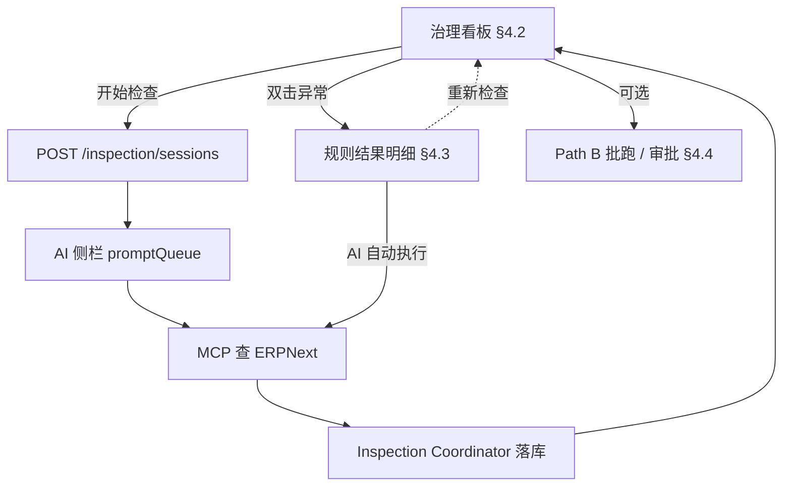
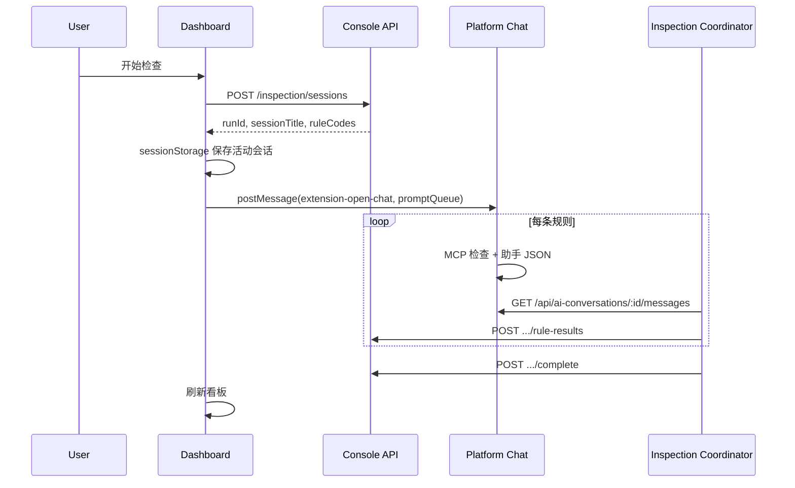

# ERP数据治理应用 — 复刻规格说明

| 项目 | 说明 |
|------|------|
| 应用标识 | `erp-healthy` |
| 应用名称 | ERP数据治理 |
| 文档版本 | **3.0** |
| 扩展目录 | `extensions/erp-healthy` |
| 访问入口（必须） | `http://localhost:4091/apps/erp-healthy` |
| 扩展 iframe 路径 | `/extension/erp-healthy/` |
| 复刻依据 | **本文档为唯一规格**，不依赖其他 PRD 或设计文件 |

---

## 目录

| 部分 | 章节 | 内容 |
|------|------|------|
| **一、概述** | [§1](#一概述) | 文档用法、背景目标、用户与范围 |
| **二、架构** | [§2](#二系统架构) | 部署、双路径、集成、约束、全局数据流 |
| **三、业务流程** | [§3](#三业务流程) | Path A 主路径：检查 → 明细 → 修复 |
| **四、页面功能** | [§4](#四页面功能规格) | 看板、明细、运行历史/审批/设置 |
| **五、规则与 MCP** | [§5](#五规则评分与-mcp) | 规则目录、评分算法、MCP 与批跑 |
| **六、数据模型** | [§6](#六数据模型) | PostgreSQL 表与字段映射 |
| **七、接口与 AI** | [§7](#七接口与-ai-契约) | Console/平台 API、Prompt、Coordinator |
| **八、非功能** | [§8](#八非功能需求) | 性能、可靠性、安全 |
| **九、复刻实施** | [§9](#九复刻实施) | 路线图（9.1）、目录树、验收、速查 |
| | [§10](#十修订记录) | 修订记录 |

> **阅读建议：** 产品/业务先读 **§1–§4**；实现重点读 **§3、§6–§7**；按 **§9.1** 路线图顺序复刻。

---

## 一、概述

### 1.1 如何使用本文档

本文档是 **唯一、可执行的复刻规格**：按顺序实现即可在 BuildingAI 上重建 `erp-healthy` 扩展。

1. 在 Cursor 中 **新开 Agent 对话**，附上本文档或相关章节。
2. 按 **[§9.1 实施路线图](#91-实施路线图)** 分阶段实现；勿跳过数据模型（§6）与平台集成（§7.4）。
3. 每阶段完成后对照 **[§9.6 验收清单](#96-验收清单)** 自测。
4. 以本文的接口、实体与 UI 行为为准；仓库内已有实现仅作参考，**不以现网代码为规格来源**。

**前置条件**

| 项 | 要求 |
|----|------|
| BuildingAI | `>= 25.1.0`（`manifest.json` `engine.buildingai`） |
| Node | `>= 22.20.x < 23` |
| 数据库 | PostgreSQL，schema `erp_healthy` |
| MCP | 控制台已注册 ERPNext MCP（默认名 `ERPnext-local`） |
| AI 模型 | 控制台已配置可用对话模型 |
| 主应用 | 含 `AppEmbeddedChatProvider`（Path A 无需改主应用聊天核心） |

### 1.2 背景与建设目标

制造企业 MRP/ERP（以 ERPNext 为主）的主数据与交易数据质量影响计划、采购与生产。本应用为 **BuildingAI Application 扩展**，经 **MCP** 连接 ERP，结合 **AI 对话检查（Path A）** 与 **规则引擎批跑（Path B）**，实现检查、落库、异常明细与 MCP 写回。

| 目标 | 能力 |
|------|------|
| 可观测 | 看板：质量分、维度分布、趋势、规则上次结果 |
| 可检查 | 看板「开始检查」→ Path A；`POST /run` → Path B |
| 可追溯 | `governance_run` / `rule_result` / `check_detail` 落库 |
| 可修复 | 明细页「AI 自动执行」写回 ERP，`executionStatus` 跟踪 |
| 可治理 | 批跑修复建议审批 + 工具白名单自动执行 |

### 1.3 目标用户与范围

| 角色 | 典型诉求 |
|------|----------|
| 数据治理专员 | 看板、发起检查、处理异常、审批 |
| 计划/物控 | 规则结果、明细、自动修复 |
| 系统管理员 | MCP、模型、阈值、Webhook |

**范围内：** 看板、规则 CRUD、AI 检查、明细、自动修复、设置、运行历史、审批、批跑流水线。

**范围外：** 独立企微/邮件（Webhook 占位）；完整 CRM 交期同步；修改主应用聊天核心逻辑。

---

## 二、系统架构

### 2.1 部署形态

```
用户浏览器
  └─ BuildingAI Client (:4091)
       ├─ /apps/erp-healthy          ← 主壳 + 右侧 AI（AppEmbeddedChatProvider）
       │    └─ iframe → /extension/erp-healthy/*
       └─ /api/ai-conversations       ← 扩展 platformHttpClient 轮询
  └─ BuildingAI API
       ├─ /erp-healthy/consoleapi/*  ← 扩展 Console API
       └─ 扩展 schema erp_healthy + TypeORM
            └─ ERPNext MCP Server
```

### 2.2 双检查路径（Path A / Path B）

| 路径 | 触发 | `runType` | 数据来源 | 规则执行 |
|------|------|-----------|----------|----------|
| **Path A（主）** | 看板「开始检查」 | `ai_inspection` | AI 现场 MCP 查询 | Prompt + 助手 JSON |
| **Path B（辅）** | `POST .../run` | `rule_engine` | Ingest 快照 | `RuleEngineService` |

看板评分与规则总览：**优先** 最近一次已完成的 `ai_inspection`，否则回退 `rule_engine`。

### 2.3 与主应用集成

| 机制 | 位置 | 作用 |
|------|------|------|
| iframe 壳 | `packages/client/src/pages/apps/[identifier].tsx` | 加载 `/extension/{identifier}` |
| 嵌入式聊天 | `packages/client/src/providers/app-embedded-chat-provider.tsx` | 监听 `extension-open-chat` |
| 打开聊天 | `packages/@buildingai/web/core/src/platform-chat.ts` | `openPlatformChat()` → `postMessage` |
| 扩展封装 | `src/web/lib/open-standard-chat.ts` | `promptQueue` + `mcpServerIds` |

### 2.4 核心约束（不可违反）

1. **Path A 不修改 `packages/client`**：仅 `postMessage` + 扩展内 Coordinator 轮询平台 API 落库。
2. **必须从 `/apps/erp-healthy` 打开**：否则右侧 AI 侧栏与 `promptQueue` 不可用。
3. **Console API 与 Web API 分离**：业务 `consoleHttpClient`；对话 `platformHttpClient`（`/api`）。
4. **一次「开始检查」= 一个 `governance_run`**（`ai_inspection`），每规则一行 `governance_rule_result` + 多行 `governance_check_detail`。

### 2.5 全局数据流



---

## 三、业务流程

本节描述 **Path A 主路径**；页面字段与控件细节见 §4，接口见 §7。

### 3.1 典型用户旅程

1. **配置**：设置页绑定 MCP 与 AI 模型（§4.4）。
2. **检查**：看板启用规则 →「开始检查」→ 右侧 AI 按规则顺序 MCP 校验 → 结果自动落库。
3. **处置**：双击「N 项异常」→ 明细页勾选行 →「AI 自动执行」→ MCP 写 ERP → 行标为已执行。
4. **复验**：修正 ERP 数据后再次「开始检查」，更新质量分与通过率。

### 3.2 Path A：开始检查



**前端步骤**（`dashboard/index.tsx`）：

1. `getConfig()` + `listAiModels()` → `mcpServerId`、`getAiCheckModelId()`。
2. `startInspectionSession(enabledRuleCodes)`。
3. `saveActiveInspectionSession({ runId, sessionTitle, rules, startedAt })`。
4. `openStandardInspectionChat({ rules, runId, modelId, mcpServerId })`（首条延迟 3s）。
5. `useInspectionCoordinator({ onComplete: load, onProgress: refreshRules })`。

**侧栏内 AI 行为：** 识别 `ruleCode`/`runId` 元数据 → MCP 拉数校验 → 末尾输出 JSON（§7.3）或 Markdown 表格（协调器可推断）。

### 3.3 异常查看与 AI 自动修复

1. 看板规则表 **双击**「上次结果」（需 `lastRuleResultId`）→ 进入明细页。
2. 勾选待执行异常 →「AI 自动执行」→ `openAutoFixChat` 按行排队 Prompt（§7.3）。
3. `useAutoFixCoordinator` 解析助手 JSON → `mark-executed` → **全部**选中行完成后刷新列表。

自动修复 **不** 重算规则 `failedRecords`；更新看板评分须再次「开始检查」。

### 3.4 并发与互斥

| 场景 | 规则 |
|------|------|
| 重复开始检查 | `activeInspection` 或 `GET /inspection/sessions/active` 存在时禁止 |
| 检查中自动修复 | 明细页禁止启动自动修复 |
| 检查 vs 自动修复会话 | `inspection-active-session` 与 `auto-fix-active-session` **隔离** |
| AI 对话按钮 | 仅打开空侧栏，不注入 `promptQueue`（§4.2） |

---

## 四、页面功能规格

### 4.1 路由与后端模块

**前端路由**（`src/web/routes.tsx`，`base: extension/erp-healthy`）

| 路由 | 组件 | 说明 |
|------|------|------|
| `/` | `dashboard/index.tsx` | 治理看板（§4.2） |
| `/inspection/results/:ruleResultId` | `inspection/rule-result.tsx` | 规则明细（§4.3） |
| `/runs`、`/runs/:id` | `runs/*` | 运行历史 |
| `/approvals` | `approvals/index.tsx` | 待审批（Path B） |
| `/settings` | `settings/index.tsx` | MCP / 模型 / Webhook |

**后端模块**（`src/api/modules/app.module.ts`）

| 模块 | 前缀 | 职责 |
|------|------|------|
| `ConfigModule` | `config` | 全局配置 |
| `DashboardModule` | `dashboard` | 看板 summary / trend / rules |
| `InspectionModule` | `inspection` | AI 检查会话 |
| `RunModule` | `run` + `proposals` | 批跑 + 审批 |
| `AiCheckModule` | `ai-check` | 遗留单规则 AI（非主路径） |

---

### 4.2 治理看板

**主控制台**：质量健康度、维度分布、评分趋势、规则表与「开始检查」；双击异常进入 §4.3。

**实现：** `dashboard/index.tsx`、`dashboard-visuals.tsx`、`rules-overview-table.tsx`。

#### 4.2.1 页面定位与入口

| 项 | 说明 |
|----|------|
| **路由** | `/`（扩展首页） |
| **主壳入口** | `http://localhost:4091/apps/erp-healthy`（须从 `/apps/...` 打开，右侧 AI 侧栏与 `promptQueue` 才可用） |
| **副标题** | 「MCP 对接 ERPNext · 开始检查后于页面右侧打开 AI 对话」；检查进行中追加「检查进行中，结果将自动保存」 |
| **下游页面** | 双击「上次结果」→ §4.3；页头 → 运行历史 / 审批 / 设置 |

#### 4.2.2 页头全局导航

| 按钮 | 行为 |
|------|------|
| **AI 对话** | `openEmbeddedAiPanel()` → 打开右侧侧栏，**不**注入检查 Prompt（与「开始检查」区分，可自由问答） |
| **运行历史** | `/runs`：历次 `governance_run` 列表 |
| **审批** | `/approvals`：批跑产生的 `remediation_proposal` 待审批（Path B） |
| **设置** | `/settings`：MCP 服务、AI 检查模型、规则阈值、Webhook 等 |

#### 4.2.3 指标与可视化区

页面加载并行请求：`GET /dashboard/summary`、`/dashboard/trend?limit=10`、`/dashboard/rules`。

**数据质量健康度（`ScoreHero`）**

| 元素 | 数据来源 | 说明 |
|------|----------|------|
| 环形质量分 | `summary.score` | 来自 **最近一次有效运行** 的得分（优先 `ai_inspection` 已完成，否则 `rule_engine` 已完成） |
| 健康状态文案 | 按分数分段 | `≥80` 健康；`60–79` 需关注；`<60` 风险较高；无分数时「待检查」 |
| 高/中徽章 | `summary.issueCounts` | 展示高、中严重度 **异常条数**（非规则条数） |

**示例：** 21 条高严重度静态主数据异常、质量分 0 → 显示「风险较高」、高 21、中 0。

**待办指标卡（`MetricCard`）**

| 卡片 | 字段 | 说明 |
|------|------|------|
| 待修复高严重度 | `issueCounts.high` | 最新运行中高严重度失败记录数；副文案「需优先处理」 |
| 待审批修复 | `pendingApprovals` | `remediation_proposal` 中 `approvalStatus=pending` 数量（批跑修复建议，Path B） |

**维度分布（`DimensionPanel` × 3）**

按规则目录 `category` 汇总 **失败记录数**（`failedRecords` 之和，仅统计有异常的规则结果）：

| 维度 | `category` | 图标色调 |
|------|------------|----------|
| 静态主数据 | `static` | 天蓝 |
| 库存 | `inventory` | 翠绿 |
| 订单 | `order` | 琥珀 |

每块显示：维度名称、异常条数、占当前总异常的比例条（`count / static+inventory+order`）。

#### 4.2.4 评分趋势与治理概览

**评分趋势（`ScoreTrendPanel`）**

- 数据：`GET /dashboard/trend`（默认最近 10 次 **已完成** 运行）。
- 柱状图：横轴为运行序号，柱高为当次 `score`；颜色分段（≥80 绿、≥60 琥珀、&lt;60 玫红）。
- 无数据时：「暂无已完成的运行」。

**治理概览（`GovernanceOverviewPanel`）**

| 行 | 内容 |
|----|------|
| 最近一次质量分 | 与 `ScoreHero` 同源 `summary.score` |
| 中严重度问题 | `issueCounts.medium` |
| 低严重度问题 | `issueCounts.low` |

当质量分 &lt; 80 时显示提示条：「建议开启下方规则并执行检查，优先处理高严重度异常。」

#### 4.2.5 检查规则与上次结果（`RulesOverviewTable`）

看板下半区：规则目录、上次结果、「开始检查」。

**工具栏**

| 控件 | 说明 |
|------|------|
| 标题区徽章 | 「已开启 N」「共 M 条」；有异常规则时显示「异常 K」 |
| 上次检查时间 | 各规则 `lastCheckAt` 的最大值，或 `lastRunAt` |
| **新增规则** | 打开 `RuleEditDialog`；检查进行中禁用 |
| **开始检查** | 对 **所有已开启** 规则发起 Path A；进行中显示「检查中…」并禁用 |

**规则表列**

| 列 | 说明 |
|----|------|
| 数据项 | 如「静态主数据」「BOM」「采购订单」；点击可打开编辑 |
| 检查规则/方法 | 自然语言检查描述（发给 AI 的 `method`） |
| 严重程度 | `high` / `medium` / `low` 徽章 |
| 上次检查时间 | 该规则在展示用 run 上的结果时间 |
| 上次结果 | 「通过」「N 项异常」等；**双击** 且存在 `lastRuleResultId` 时跳转 §4.3 |
| 是否开启 | `Switch` → `PATCH /dashboard/rules/:ruleCode/enabled` |
| 操作 | 编辑、删除（内置规则删除为隐藏，可配置恢复） |

**规则来源：** 内置 `RULE_CATALOG`（15 条）+ `CUSTOM_*` 自定义规则；禁用列表 `disabledRules`。

**检查进行中：** `summary.activeInspection` 存在时，表内逐条刷新 `lastResult`（`useInspectionCoordinator` → `onProgress` → `refreshRules`）；可选 `checkingRuleCode` 高亮当前规则行（组件已支持，看板暂未传参）。

**规则 CRUD**

规则增删改启停接口见 **§7.1**（`/dashboard/rules`）。

**右侧 AI 侧栏：**「开始检查」注入 `promptQueue`；「AI 对话」仅打开空侧栏。流程与互斥见 **§3.2、§3.4**。

---

### 4.3 规则结果明细

单条规则的 **检查报告 + 异常工单列表 + AI 驱动 MCP 修复台**。用户在此查看某次治理检查中一条规则未通过的记录，勾选后由 AI 经 MCP 写回 ERPNext，系统跟踪每条是否已执行；修正源数据后需 **重新发起检查** 才能更新看板评分与通过率。

**实现：** 页面 `pages/inspection/rule-result.tsx`；核心 UI `components/rule-result-detail-view.tsx`。

#### 4.3.1 页面定位与入口

| 项 | 说明 |
|----|------|
| **路由** | `/inspection/results/:ruleResultId`（扩展 base：`/extension/erp-healthy/...`） |
| **主壳入口** | `http://localhost:4091/apps/erp-healthy`（须从 `/apps/...` 打开，右侧 AI 侧栏才可用） |
| **典型进入** | 治理看板 `RulesOverviewTable` **双击「上次结果」**（需 `lastRuleResultId`）；运行历史等带 `ruleResultId` 的链接 |
| **路由 state** | `dataItem`（数据项名称）、`lastResult`（上次结果文案，如「21 项异常」） |
| **返回** | 页顶「返回看板」→ `/` |

**示例场景：** 数据项「物料主数据」，规则 `LEAD_TIME_INVALID`（检查物料 `lead_time_days` 是否大于 0），21 条全部异常 → 检查总数 21、异常 21、通过率 0%。

#### 4.3.2 页面结构

**页头（规则级结论）**

| 元素 | 数据来源 | 说明 |
|------|----------|------|
| 标题 | `dataItem`（state）或 `ruleResult.module` | 如「物料主数据」 |
| 状态徽章 | `conclusion`、`failedRecords`、`lastResult` | 「N 项异常」「通过」「检查失败」；异常为粉红/警示样式 |
| 检查时间 | `ruleResult.updatedAt` | `formatCheckTime` 展示 |
| 规则说明 | `ruleResult.ruleDescription` | 如「检查物料提前期是否大于 0」 |

此为 **单条 `governance_rule_result`** 的摘要，非整次 `governance_run` 全局页。

**指标卡片（三列）**

| 卡片 | 字段 | 说明 |
|------|------|------|
| 检查总数 | `totalRecords` | 本规则本次检查覆盖记录数 |
| 异常数量 | `failedRecords` | 未通过条数；>0 时副文案「需修正后重检」 |
| 通过率 | `passRate` | 百分比；100% 为绿色强调 |

**摘要与处理建议**

- **文字摘要**（`summary`）：人类可读说明；若内容为原始 Markdown 表格（`isRawMarkdownSummary`）则不在页头重复展示。
- **处理建议**（`suggestion`）：黄色 `Alert`，指引在 ERPNext 修正后 **重新检查**（只读指引，不自动执行）。

**无异常状态**

当 `failedRecords === 0` 或结论为通过时，不展示异常表，显示绿色空状态：「未发现异常记录 / 当前规则下数据符合治理要求」。

#### 4.3.3 异常明细表

仅在 `failedRecords > 0` 时展示；`GET /inspection/rule-results/:id/details` 分页加载（§7.1）。

**列定义**

| 列 | 实体字段 | 说明 |
|----|----------|------|
| 状态 | `executionStatus` | `pending` →「待执行」；`executed` →「已执行」 |
| 编码 | `docCode` | 如 `ITEM-002` |
| 名称 | `docName` | 如「CPU 处理器」 |
| 字段 | `fieldName` | 如 `lead_time_days` |
| 当前值 | `currentValue` | 检查时的值（高亮展示） |
| 期望 | `expectedValue` | 规则要求（如 `> 0`） |

**筛选、分页与视图**

| 功能 | 行为 |
|------|------|
| 默认视图 | 仅 **待执行**（query `executionStatus=pending`） |
| 「显示已执行」 | 切换为 `all`，含已修复历史 |
| 客户端筛选 | 编码、名称输入框（**当前页** `items` 上过滤）；可「清空」 |
| 服务端分页 | `page` / `pageSize`（默认 50）；多页时页脚上一页/下一页 |
| 条数徽章 | 有筛选时显示 `筛选数 / 当前页条数`；否则显示 `total` |

**批量选择**

- 行首复选框 + 表头全选（作用于 **当前筛选后且非已执行** 的行）。
- **已执行** 行不可选；**自动修复进行中** 时，已选行锁定不可取消勾选。
- 工具栏显示「已选 N」。

#### 4.3.4 AI 自动执行

经右侧 AI 侧栏 + MCP 写回 ERP；协调器落库行状态。流程概览见 **§3.3**。

**用户操作流程**

1. 勾选一条或多条 **待执行** 异常行。
2. 点击 **「AI 自动执行」**。
3. 前置校验（失败则 toast，不启动）：
   - 至少选中一行；
   - `ruleResult.ruleCode` 存在；
   - **无进行中的 AI 全量检查**（`GET /inspection/sessions/active`）；
   - **本规则无进行中的自动修复**（`auto-fix-active-session` 同 `ruleResultId`）；
   - 设置中已配置 `mcpServerId` 与 AI 检查模型（`getAiCheckModelId`）。
4. `openAutoFixChat()` → `postMessage(extension-open-chat, promptQueue)`，约 **3 秒** 后按行顺序发送修复 Prompt。
5. 执行中显示加载态；可点 **「重置」** 清除 `auto-fix-active-session` 后重新选择。

**Prompt 与协调器**

元数据、JSON 格式与 `use-auto-fix-coordinator` 行为见 **§7.3、§7.4**。

**后台协调（`use-auto-fix-coordinator.ts`）**

| 步骤 | 说明 |
|------|------|
| 会话存储 | `sessionStorage` → `auto-fix-active-session`（含 `runId`、`ruleResultId`、`detailIds`、`persistedDetailIds`） |
| 轮询 | `GET /api/ai-conversations/:id/messages`（`platform-http-client`） |
| 匹配 | `auto-fix-message-match.ts`：`taskType=auto_fix` + `detailId=` → 对应助手消息 |
| 解析 | `parse-auto-fix-message.ts` 从助手回复提取 JSON |
| 落库 | `POST .../details/mark-executed`，body `{ detailIds: string[] }` |
| 完成策略 | **全部**所选行均 `mark-executed` 后调用 `onComplete` 刷新列表（避免中途闪动） |
| 会话隔离 | **不**写入 `inspection-active-session`；与 Path A 全量检查会话独立 |
| 过期/失败 | `expired` / `no_conversation` / `unresolved` 时清除会话并 toast |

`runId` 格式：`{ruleResultId}-autofix-{timestamp}`，与检查 run 区分。

**实现文件：** `rule-result-detail-view.tsx`、`build-auto-fix-prompt.ts`、`open-auto-fix-chat.ts`、`use-auto-fix-coordinator.ts`。

---

### 4.4 运行历史、审批与设置

| 页面 | 路由 | 说明 |
|------|------|------|
| 运行历史 | `/runs`、`/runs/:id` | 历次 `governance_run` 及问题列表（Path A/B） |
| 审批 | `/approvals` | `remediation_proposal` 待审批；批准 / 拒绝 / 执行 MCP（Path B） |
| 设置 | `/settings` | 见下表 |

**设置项**（`governance_config`）

| 配置项 | 字段 | 说明 |
|--------|------|------|
| MCP 服务 | `mcpServerId` | UUID；默认匹配 `ERPnext-local` |
| AI 检查模型 | `ruleThresholds.aiCheckModelId` | 检查 + 自动修复 |
| 诊断模型 | `ruleThresholds.diagnosisModelId` | 批跑诊断 |
| Webhook | `notifyChannels.webhook` | 高严重度告警（占位） |

**审批（Path B）：** 实体 `remediation_proposal`（`pending` / `approved` / `rejected` / `auto_approved`）；配置 `criticalToolPatterns`、`autoExecuteWhitelist`。

---

## 五、规则、评分与 MCP

### 5.1 质量评分算法

```text
score = max(0, 100 - (high × 8 + medium × 3 + low × 1))
```

权重：`SCORE_WEIGHTS`（`governance.constants.ts`）。

| 运行类型 | 计数来源 |
|----------|----------|
| `ai_inspection` | 各 `governance_rule_result.failedRecords` × 规则 `severity`；维度按 `category` |
| `rule_engine` | `quality_issue` 按 severity / category |

看板 summary **优先** 最近一次已完成的 `ai_inspection`，否则回退 `rule_engine`。

### 5.2 内置规则（15 条）

定义文件：`src/api/modules/rules/rule-catalog.ts`（`RULE_CATALOG`）。

| ruleCode | 分类 | 严重度 | MCP 资源 |
|----------|------|--------|----------|
| LEAD_TIME_INVALID | static | high | mrp.materials |
| LEAD_TIME_OUTLIER | static | medium | materials + purchase_orders |
| SAFETY_STOCK_UNREASONABLE | static | medium | mrp.materials |
| DUPLICATE_ITEM_CODE | static | medium | mrp.materials |
| BOM_OBSOLETE_ITEM | static | high | materials + bom |
| BOM_USAGE_DEVIATION | static | high | mrp.bom |
| INVENTORY_MOVE_DELAY | inventory | high | inventory_moves |
| PO_CONFIRM_DATE_MISSING | inventory | high | purchase_orders |
| PO_UNDER_DELIVERY | inventory | medium | purchase_orders |
| QC_STATUS_STALE | inventory | high | quality_records |
| PROD_STATUS_MISMATCH | inventory | high | production_orders |
| PROD_LATE_NO_APPROVAL | order | high | production_orders |
| SO_CLOSED_SUPPLY_OPEN | order | high | sales + purchase + production |
| SO_DELIVERY_NOT_SYNCED | order | medium | sales_orders |
| PO_OVERDUE_DELIVERY | order | high | purchase_orders |

### 5.3 自定义规则与阈值

- 自定义规则：`governance_config.ruleThresholds.customRules`，code 前缀 `CUSTOM_*`。
- 启用/禁用：`disabledRules: string[]`。
- 默认阈值 `DEFAULT_RULE_THRESHOLDS`：`leadTimeZScore`、`bomUsageDeviationPercent`、`inventoryMoveDelayHours`、`poOverdueDays`、`qcStaleHours`、`aiCheckModelId` 等。

### 5.4 MCP 逻辑资源（ERP 侧约定）

ERP MCP 服务端应暴露以下 **逻辑数据集**（资源 URI/名称由实现方自定；本应用批跑与规则引擎通过 `resourceKey` 对齐）。建议支持分页、按时间/物料过滤及 `updated_after` 增量拉取。

| resourceKey | 描述 | 数据内容 | 建议更新频率 |
|-------------|------|----------|--------------|
| `mrp.materials` | 物料主数据 | 编码、名称、提前期、安全库存、订货策略、启用状态 | 按需 |
| `mrp.bom` | 物料清单 | BOM 头（父项、版本、生失效）及行（子项、用量、损耗率） | 按需 |
| `mrp.inventory` | 当前库存快照 | 物料、仓库、库存状态、可用量 | 每小时 |
| `mrp.inventory_moves` | 库存移动 | 近 7 天入/出库/移库/发料（时间、数量、关联单号） | 每小时增量 |
| `mrp.quality_records` | 质量检验 | 近 7 天检验/拒收/让步（物料、数量、判定） | 每小时 |
| `mrp.sales_orders` | 未结销售订单 | 订单号、物料、数量、需求日期、状态 | 每小时 |
| `mrp.purchase_orders` | 未结采购订单 | 订单号、物料、数量、计划/确认到货日、已收量 | 每小时 |
| `mrp.production_orders` | 未结生产订单 | 订单号、物料、计划量、合格入库量、计划/实际完工 | 每小时 |
| `mrp.planned_orders` | MRP 计划订单 | 计划单号、物料、数量、建议日期、确认状态 | MRP 运行后 |

**工具（写回）：** ERP 通过 MCP `tools/list` 暴露能力（如更新物料字段、关闭 PO、改 BOM 用量等）。工具须有清晰 `description` 与 JSON Schema 参数；输出建议含 `success`、`message`、可选 `data`。Path A 自动修复与 Path B 审批执行均依赖 AI 按语义选工具，**不预置固定工具名**；缺工具时 AI 应给出人工操作指引。

**安全：** 关键写操作走审批（§4.4）；非关键可配置 `autoExecuteWhitelist`。

### 5.5 数据集注册表（Path B 映射）

`src/api/modules/ingest/dataset-registry.ts` → `McpBridgeService` 拉取 ERPNext Doctype，写入 `data_snapshot`。

| resourceKey | Doctype |
|-------------|---------|
| mrp.materials | Item |
| mrp.bom | BOM |
| mrp.inventory | Bin |
| mrp.inventory_moves | Stock Entry（7 天） |
| mrp.quality_records | Quality Inspection |
| mrp.sales_orders | Sales Order |
| mrp.purchase_orders | Purchase Order |
| mrp.production_orders | Work Order |
| mrp.planned_orders | （按注册表） |

### 5.6 批跑状态机（Path B）

`RunService.executeRun`：`INGESTING` → `CHECKING` → `DIAGNOSING` → `PROPOSING` → `COMPLETED`。

### 5.7 规则表「上次结果」展示状态

| 展示 | 条件 |
|------|------|
| 尚未检查 | 无 completed 历史 |
| 检查中… | checking 且该规则未 persist |
| 通过 | failedRecords = 0 |
| N 项异常 | failedRecords > 0 |
| 检查失败 | parseFailed |
| 已关闭 | 规则 disabled |

---

## 六、数据模型

PostgreSQL schema：`erp_healthy`。实体使用 `@ExtensionEntity`；迁移见 §6.4。

### 6.1 表清单

| 表 | Entity | 用途 |
|----|--------|------|
| governance_config | `GovernanceConfig` | 配置与阈值 |
| governance_run | `GovernanceRun` | 检查/批跑会话 |
| governance_rule_result | `GovernanceRuleResult` | 单规则汇总 |
| governance_check_detail | `GovernanceCheckDetail` | 异常行 + executionStatus |
| data_snapshot | `DataSnapshot` | MCP 快照 |
| quality_issue | `QualityIssue` | 规则引擎问题 |
| issue_diagnosis | `IssueDiagnosis` | 诊断 |
| remediation_proposal | `RemediationProposal` | 修复建议 |
| action_log | `ActionLog` | 执行日志 |

### 6.2 governance_run 关键字段

| 字段 | 说明 |
|------|------|
| runType | `ai_inspection` \| `rule_engine` |
| status | pending … completed / failed；AI 检查中用 `checking` |
| sessionTitle | `数据检测 YYYY-MM-DD HH:mm:ss` |
| conversationId | 平台对话 UUID |
| inspectionMeta | `{ ruleCodes, expectedCount, persistedCount }` |
| score / issueCounts | 完成后写入 |

### 6.3 检查任务与落库字段映射

Path A（AI 检查）**不**使用独立的 `data_quality_check_*` 表，统一落在下列实体。

**任务（一次「开始检查」）→ `governance_run`**

| 概念字段 | 列 | 说明 |
|----------|-----|------|
| task_id | `id` | uuid |
| check_time | `startedAt` / `finishedAt` | |
| executor | `executor` | |
| data_source | `dataSource` | 如 ERPNext |
| status | `status` | AI 检查：`checking` → `completed` |
| — | `runType` | 固定 `ai_inspection` |
| — | `sessionTitle` | `数据检测 YYYY-MM-DD HH:mm:ss` |
| — | `conversationId` | 平台对话 UUID |
| — | `inspectionMeta` | `{ ruleCodes, expectedCount, persistedCount }` |

**单规则结果 → `governance_rule_result`**

| 概念字段 | 列 |
|----------|-----|
| task_id | `runId` |
| module | `module` |
| rule_name / description | `ruleName`, `ruleDescription` |
| total_records, failed_records, pass_rate | `totalRecords`, `failedRecords`, `passRate` |
| summary, conclusion, suggestion | `summary`, `conclusion`, `suggestion` |
| — | `ruleCode` | 与规则目录对齐 |

**异常明细 → `governance_check_detail`**

| 概念字段 | 列 |
|----------|-----|
| rule_result_id | `ruleResultId` |
| doc_type, doc_code, doc_name | `docType`, `docCode`, `docName` |
| field_name, current_value, expected_value | `fieldName`, `currentValue`, `expectedValue` |
| additional_info | `additionalInfo` (jsonb) |
| — | `executionStatus` | `pending` \| `executed`（自动修复后标记） |

### 6.4 迁移

| 版本 | 文件 | 内容 |
|------|------|------|
| 0.1.0 | `0.1.0-initial.ts` | 创建 schema |
| 0.2.0 | `0.2.0-ai-inspection.ts` | run 扩展字段 + rule_result + check_detail |
| 0.2.1 | `0.2.1-detail-execution-status.ts` | detail.executionStatus 索引 |

实体使用 `@ExtensionEntity("table_name")`，安装扩展时由平台同步 + 迁移执行。

---

## 七、接口与 AI 契约

**Base（Console）：** `{origin}/erp-healthy/consoleapi`（前缀默认 `/consoleapi`）  
**Base（平台）：** `{origin}/api`（`platform-http-client.ts`）

前端封装：`src/web/services/console/governance.ts`、`inspection.ts`；`createPluginHttpClients()`。

### 7.1 Console API

| 方法 | 相对路径 | 说明 |
|------|----------|------|
| GET | `/inspection/sessions/active` | 进行中的 AI 检查 |
| POST | `/inspection/sessions` | 创建会话；`{ ruleCodes?: string[] }` |
| PATCH | `/inspection/sessions/:runId` | `{ conversationId }` |
| POST | `/inspection/sessions/:runId/rule-results` | 幂等 upsert 单规则结果 + 明细 |
| POST | `/inspection/sessions/:runId/complete` | 结束并算分 |
| GET | `/inspection/rule-results/:ruleResultId/details` | `page`, `pageSize`, `executionStatus` |
| POST | `/inspection/rule-results/:ruleResultId/details/mark-executed` | `{ detailIds: string[] }` |
| GET | `/dashboard/summary` | 看板汇总 |
| GET | `/dashboard/trend?limit=10` | 评分趋势 |
| GET | `/dashboard/rules` | 规则总览 |
| PATCH | `/dashboard/rules/:ruleCode/enabled` | `{ enabled }` |
| POST/PUT/DELETE | `/dashboard/rules` … | 自定义规则 CRUD |
| GET/PUT | `/config` | 配置 |
| POST | `/run` | 创建批跑 |
| GET | `/run`, `/run/:id`, `/run/:id/issues` | 运行与问题 |
| GET | `/proposals` | 待审批列表 |
| POST | `/proposals/:id/approve\|reject\|execute` | 审批动作 |

### 7.2 平台 Web API（Coordinator 轮询）

| 方法 | 路径 | 用途 |
|------|------|------|
| GET | `/ai-conversations?page&pageSize` | 绑定新会话 |
| GET | `/ai-conversations/:id/messages?page&pageSize` | 拉取助手回复（建议 pageSize≥200） |
| PATCH | `/ai-conversations/:id` | 更新标题为 `sessionTitle` |

### 7.3 Prompt 与结构化输出

**检查 Prompt**（`build-inspection-prompt.ts`）：

```text
请检查：{dataItem}
规则：{method}
【元数据】ruleCode={code}; runId={runId}; seq={n}/{total}
【输出要求】先用 MCP 完成检查；末尾唯一 ```json 代码块
```

**检查 JSON schema**（`inspection-result.schema.ts` / Zod）：

```json
{
  "ruleCode": "LEAD_TIME_INVALID",
  "totalRecords": 100,
  "failedRecords": 3,
  "passRate": 97,
  "summary": "人类可读摘要",
  "conclusion": "符合规范 | 存在异常 | 检查失败",
  "suggestion": "处理建议",
  "details": [{
    "docType": "Item", "docCode": "F-001", "docName": "示例物料",
    "fieldName": "lead_time_days", "currentValue": "0", "expectedValue": "> 0",
    "additionalInfo": {}
  }]
}
```

**解析顺序：** JSON 代码块 → Markdown 表格推断 → `parseFailed=true`。

**自动修复 Prompt**（`build-auto-fix-prompt.ts`）元数据：

```text
taskType=auto_fix; ruleCode={code}; runId={runId}; detailId={uuid}; seq={n}/{total}
```

**自动修复 JSON 示例：**

```json
{"detailId":"<uuid>","docCode":"F-001","status":"updated","message":"已更新"}
```

队列：`buildInspectionPromptQueue` / `buildAutoFixPromptQueue` → `openPlatformChat({ promptQueue, initialDelayMs: 3000, mcpServerIds })`。

### 7.4 Coordinator 与 postMessage

**extension-open-chat**（`platform-chat.ts`）

| 字段 | 说明 |
|------|------|
| `type` | `"extension-open-chat"` |
| `prompt` | 首条（= `promptQueue[0]`） |
| `promptQueue` | 顺序发送，上一条助手完成后发下一条 |
| `initialDelayMs` | 首条延迟（默认 3000） |
| `modelId` / `mcpServerIds` | 模型与 MCP UUID |

**extension-show-chat-panel：** 空侧栏，无队列（看板「AI 对话」）。

**Coordinator 职责**

| 组件 | sessionStorage | 行为 |
|------|----------------|------|
| Inspection | `inspection-active-session` | 绑定 conversation → 解析检查 JSON → rule-results → complete |
| Auto-fix | `auto-fix-active-session` | 解析修复 JSON → mark-executed |

**消息匹配：** 检查 — 用户消息含 `runId=`、`ruleCode=`，助手为其后第一条 `assistant`（`inspection-message-match.ts`）。修复 — `taskType=auto_fix` + `detailId=`（`auto-fix-message-match.ts`）。

**会话完成：** `inspectionMeta.expectedCount ===` 已持久化规则数；每条助手 `status === completed`，否则 `complete` 拒绝。

---

## 八、非功能需求

| 类别 | 要求 |
|------|------|
| 性能 | 单规则明细上限 500；Coordinator 轮询 2s（前台）/ 5s（后台） |
| 可靠性 | `(runId, ruleCode)` 幂等；sessionStorage 刷新恢复 |
| 安全 | Console API 鉴权；MCP 写操作审批/白名单 |
| 兼容 | Chrome/Edge；iframe postMessage 同源 |

---

## 九、复刻实施

### 9.1 实施路线图（按序执行）

**阶段 0：脚手架**

```bash
# 在 monorepo 根目录
pnpm extension:create   # 或复制 templates/extension-starter → extensions/erp-healthy
```

必须文件：

- `manifest.json`：`identifier: erp-healthy`，`type: application`，`engine.buildingai: ">=25.1.0"`
- `package.json`：依赖 `@buildingai/extension-sdk`、`@buildingai/web-core`、`@buildingai/db` 等（见 §9.2）
- `src/api/index.ts` 导出 `AppModule`
- `src/web/main.tsx` + `routes.tsx`
- `tsup.config.ts` / `vite.config.ts`

在 `packages/@buildingai/db/src/seeds/data/web-menu.json` 增加菜单项 `path: /apps/erp-healthy`（可选，便于入口）。

**阶段 1：数据层**

1. 创建 `src/api/constants/governance.constants.ts`（枚举、阈值、评分权重）。
2. 创建全部 `@ExtensionEntity`（§6.1）。
3. 编写迁移 `0.1.0` → `0.2.1`（§6.4）。
4. 在扩展入口注册 migrations（extension-sdk 约定；迁移见 §6.4）。

**阶段 2：配置与规则**

1. `ConfigModule` + `ConfigService.getOrCreateDefault()`。
2. `rule-catalog.ts` + `rule-registry.ts`（内置 + 自定义 + disabled）。
3. `DashboardModule`：`getSummary`、`getTrend`、`getRulesOverview`、规则 CRUD。

**阶段 3：Path A — AI 检查**

1. `InspectionModule`：`startSession` / `bindConversation` / `persistRuleResult` / `completeSession` / 明细分页 / `markDetailsExecuted`。
2. 前端 `build-inspection-prompt.ts`、`open-standard-chat.ts`。
3. `inspection-active-session.ts`（sessionStorage）。
4. `use-inspection-coordinator.ts` + 看板 `handleStart` 接线。
5. `platform-conversations.ts` + `platform-http-client.ts`。
6. 确认主应用已有 `AppEmbeddedChatProvider`（BuildingAI 25.1+ 自带）。

**阶段 4：看板 UI**

1. `dashboard-visuals.tsx`（ScoreHero、DimensionPanel、Trend）。
2. `rules-overview-table.tsx`（开关、CRUD 对话框、开始检查、双击跳转）。
3. `settings/index.tsx`（MCP、模型列表、保存 config）。

**阶段 5：明细与自动修复**

1. `rule-result-detail-view.tsx` + `rule-result.tsx` 路由。
2. `build-auto-fix-prompt.ts`、`open-auto-fix-chat.ts`、`use-auto-fix-coordinator.ts`。
3. 迁移 `0.2.1` executionStatus。

**阶段 6：Path B — 批跑（可选）**

1. `IngestModule` + `dataset-registry` + `McpBridgeService`。
2. `RuleEngineService` + `RunService.executeRun`。
3. `DiagnosisModule`、`ProposalModule`、`ActionExecutorService`。
4. `runs/list.tsx`、`runs/detail.tsx`、`approvals/index.tsx`。

**阶段 7：构建与联调**

```bash
nvm use 22
cd extensions/erp-healthy
pnpm install
pnpm dev                    # 或 build:publish + extension:sync
# 根目录
pnpm extension:sync
pnpm start                  # 或 dev:web + dev:api
```

访问：`http://localhost:4091/apps/erp-healthy` → 设置 MCP/模型 → 启用规则 → 开始检查。

---

### 9.2 完整源码目录树

```text
extensions/erp-healthy/
├── manifest.json
├── package.json
├── tsup.config.ts              # API 打包
├── vite.config.ts              # Web 打包
├── src/
│   ├── api/
│   │   ├── index.ts            # export AppModule
│   │   ├── constants/governance.constants.ts
│   │   ├── db/
│   │   │   ├── entities/*.entity.ts
│   │   │   └── migrations/0.1.0 | 0.2.0 | 0.2.1
│   │   └── modules/
│   │       ├── app.module.ts
│   │       ├── config/
│   │       ├── dashboard/
│   │       ├── inspection/     # Path A 核心
│   │       ├── run/            # Path B + proposals controller
│   │       ├── ingest/
│   │       ├── rules/          # catalog + engine
│   │       ├── diagnosis/
│   │       ├── proposal/
│   │       ├── action/
│   │       ├── notification/
│   │       └── ai-check/       # 遗留
│   └── web/
│       ├── main.tsx
│       ├── routes.tsx
│       ├── pages/
│       │   ├── dashboard/
│       │   ├── inspection/
│       │   ├── runs/
│       │   ├── approvals/
│       │   └── settings/
│       ├── components/
│       ├── hooks/
│       │   ├── use-inspection-coordinator.ts
│       │   └── use-auto-fix-coordinator.ts
│       ├── lib/                # prompt / parse / platform / session
│       └── services/console/   # governance.ts, inspection.ts
└── build/                      # 发布后产物
```

**主应用（只读依赖，复刻时勿改）：**

```text
packages/client/src/pages/apps/[identifier].tsx
packages/client/src/providers/app-embedded-chat-provider.tsx
packages/@buildingai/web/core/src/platform-chat.ts
```

---

### 9.3 Nest 模块依赖关系

```text
AppModule
├── ConfigModule
├── DashboardModule ──► ConfigModule, Inspection entities
├── InspectionModule ──► ConfigModule, DashboardModule
├── RunModule ──► Ingest, Diagnosis, Proposal, Action, Notification
└── AiCheckModule
```

`RunModule` 同时注册 `RunController` 与 `ProposalController`。

---

### 9.4 环境变量与本地运行

| 变量 | 典型值 | 说明 |
|------|--------|------|
| VITE_APP_CONSOLE_API_PREFIX | `/consoleapi` | 与后端 ExtensionConsoleController 一致 |
| VITE_APP_WEB_API_PREFIX | `/api` | 平台对话 API |
| VITE_DEVELOP_APP_BASE_URL | `http://localhost:4091` | 扩展 dev 时 API  origin |

扩展 dev：`cd extensions/erp-healthy && pnpm dev`（Vite + tsup watch）。

**注意：** 生产/集成测试务必用 `/apps/erp-healthy`；仅打开 `/extension/erp-healthy` 无右侧 AI。

---

### 9.5 测试

```bash
cd extensions/erp-healthy
pnpm test    # vitest: prompt parse, message match, markdown infer
```

单测文件示例：`parse-inspection-message.spec.ts`、`inspection-message-match.spec.ts`、`build-auto-fix-prompt.spec.ts`。

---

### 9.6 验收清单

1. [ ] 扩展在控制台启用，`extension:sync` 成功。
2. [ ] `/apps/erp-healthy` 可打开，右侧可弹出 AI 侧栏。
3. [ ] 设置页保存 MCP + 模型。
4. [ ] 看板（§4.2）：健康度/维度/趋势/治理概览与 summary 一致；规则表启停与 CRUD 正常。
5. [ ] 开始检查（§3.2）：侧栏按规则 MCP 执行，「检查中…」锁定，完成后分数与规则表更新。
6. [ ] DB：`governance_run`（ai_inspection, completed）+ `governance_rule_result` + `governance_check_detail`。
7. [ ] 双击「上次结果」进入明细（§4.3）：页头/指标/异常表/筛选正确。
8. [ ] 「AI 自动执行」（§3.3）：全部选中行 `executed` 后刷新列表。
9. [ ] 互斥（§3.4）：检查中不可再检查、不可自动修复；可「重置」修复会话。
10. [ ] 「AI 对话」空载打开侧栏，不触发检查队列。
11. [ ] （可选）Path B 批跑与待审批数展示。

### 9.7 源码速查索引

| 主题 | 路径 |
|------|------|
| 扩展清单 | `extensions/erp-healthy/manifest.json` |
| 前端路由 | `src/web/routes.tsx` |
| 看板 | `src/web/pages/dashboard/index.tsx` |
| 规则表 | `src/web/pages/dashboard/rules-overview-table.tsx` |
| 检查 Prompt | `src/web/lib/build-inspection-prompt.ts` |
| 打开检查聊天 | `src/web/lib/open-standard-chat.ts` |
| 检查协调器 | `src/web/hooks/use-inspection-coordinator.ts` |
| 修复协调器 | `src/web/hooks/use-auto-fix-coordinator.ts` |
| 明细 UI | `src/web/components/rule-result-detail-view.tsx` |
| Inspection API | `src/api/modules/inspection/` |
| 看板服务 | `src/api/modules/dashboard/dashboard.service.ts` |
| 规则目录 | `src/api/modules/rules/rule-catalog.ts` |
| 批跑 | `src/api/modules/run/run.service.ts` |
| MCP 数据集 | `src/api/modules/ingest/dataset-registry.ts` |
| 平台 postMessage | `packages/@buildingai/web/core/src/platform-chat.ts` |
| 嵌入式 Provider | `packages/client/src/providers/app-embedded-chat-provider.tsx` |
| iframe 页 | `packages/client/src/pages/apps/[identifier].tsx` |

---

## 十、修订记录

| 版本 | 日期 | 说明 |
|------|------|------|
| 1.0 | 2026-05-19 | 首版功能规格 |
| 2.0 | 2026-05-19 | 复刻指南：路线图、目录树、API、平台契约、验收清单 |
| 2.1–2.3 | 2026-05-19 | 扩充看板/明细页；去外部文档依赖；唯一复刻规格 |
| 3.0 | 2026-05-19 | 重组文档结构：目录、业务流程独立章、合并 API、连续章节编号 |
